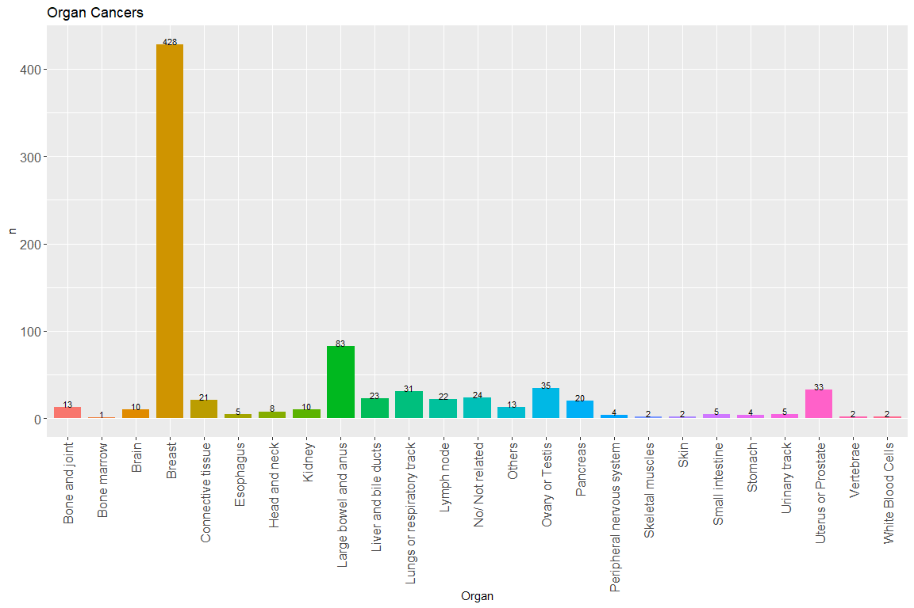

Summary Cancer of Siriraj Genomics
================

  - [Install packages](#install-packages)
  - [Import data](#import-data)
      - [Data Management](#data-management)
  - [Summary frequency and percentage of organ
    cancers](#summary-frequency-and-percentage-of-organ-cancers)
  - [Plot frequency of organ cancers](#plot-frequency-of-organ-cancers)

# Install packages

``` r
require(readr)
require(dplyr)
require(tidyr)
require(plotly)
require(knitr)
```

# Import data

``` r
data <-read.csv("Data/SirirajGenomics-CancerPatients_DATA_2021-07-16_1454.csv")
dim(data)
```

    ## [1] 697  42

``` r
names(data)
```

    ##  [1] "hn"                   "gth_project"          "organ_phenotype___1" 
    ##  [4] "organ_phenotype___2"  "organ_phenotype___3"  "organ_phenotype___4" 
    ##  [7] "organ_phenotype___5"  "organ_phenotype___6"  "organ_phenotype___7" 
    ## [10] "organ_phenotype___8"  "organ_phenotype___9"  "organ_phenotype___10"
    ## [13] "organ_phenotype___11" "organ_phenotype___12" "organ_phenotype___13"
    ## [16] "organ_phenotype___14" "organ_phenotype___15" "organ_phenotype___16"
    ## [19] "organ_phenotype___17" "organ_phenotype___18" "organ_phenotype___19"
    ## [22] "organ_phenotype___20" "organ_phenotype___21" "organ_phenotype___22"
    ## [25] "organ_phenotype___23" "organ_phenotype___24" "organ_phenotype___25"
    ## [28] "organ_phenotype___26" "organ_phenotype___27" "organ_phenotype___28"
    ## [31] "organ_phenotype___29" "organ_phenotype___30" "organ_phenotype___31"
    ## [34] "organ_phenotype___32" "organ_phenotype___33" "organ_phenotype___34"
    ## [37] "organ_phenotype___35" "organ_phenotype___36" "organ_phenotype___37"
    ## [40] "organ_phenotype___38" "organ_phenotype___39" "oth_organ_phenotype"

``` r
data$missing_organ <- rowSums( data[,3:41]) #Check missing if patientw without checking organ phenotype 
table(data$missing_organ) # 6 cases missing organ phenotype
```

    ## 
    ##   0   1   2   3   4   6   8 
    ##   6 607  61  13   8   1   1

``` r
data <- data[which(data$missing_organ != 0),] # excluded 6 cases missing organ phenotype
dim(data)
```

    ## [1] 691  43

``` r
data <- data[which(data$hn != "10-63334"),] # excluded hn 10-63334 becuase reported both of cancer and rare disease 
dim(data)
```

    ## [1] 690  43

## Data Management

``` r
#names(data)
data2<-data[, -c(1:2,42:43)]
organ <- c("No/ Not related","Brain","Eyes","Head and neck","Lungs or respiratory track","Esophagus","Stomach",
           "Small intestine","Large bowel and anus","Liver and bile ducts","Pancreas","Uterus or Prostate",
           "Ovary or Testis","Other internal reproductive organ","Other exteral reproductive organ", "Kidney",
           "Urinary track","Breast","Heart muscle","Heart valve","Cardiac conduction system","Arterial disease",
           "Venous system","Lymphatic vessels","Lymph node","Connective tissue","Red Blood Cells","White Blood Cells",
           "Platelets","Bone marrow","Skeletal muscles", "Bone and joint", "Immune system","Peripheral nervous system","Spinal cord",
           "Vertebrae","Ears/Hearing","Skin","Others")
colnames(data2) = organ ## define name of columns 
```

# Summary frequency and percentage of organ cancers

| Organ                      |   n | pecent |
| :------------------------- | --: | -----: |
| Breast                     | 428 |   62.0 |
| Large bowel and anus       |  83 |   12.0 |
| Ovary or Testis            |  35 |    5.1 |
| Uterus or Prostate         |  33 |    4.8 |
| Lungs or respiratory track |  31 |    4.5 |
| No/ Not related            |  24 |    3.5 |
| Liver and bile ducts       |  23 |    3.3 |
| Lymph node                 |  22 |    3.2 |
| Connective tissue          |  21 |    3.0 |
| Pancreas                   |  20 |    2.9 |
| Bone and joint             |  13 |    1.9 |
| Others                     |  13 |    1.9 |
| Brain                      |  10 |    1.4 |
| Kidney                     |  10 |    1.4 |
| Head and neck              |   8 |    1.2 |
| Esophagus                  |   5 |    0.7 |
| Small intestine            |   5 |    0.7 |
| Urinary track              |   5 |    0.7 |
| Stomach                    |   4 |    0.6 |
| Peripheral nervous system  |   4 |    0.6 |
| White Blood Cells          |   2 |    0.3 |
| Skeletal muscles           |   2 |    0.3 |
| Vertebrae                  |   2 |    0.3 |
| Skin                       |   2 |    0.3 |
| Bone marrow                |   1 |    0.1 |

# Plot frequency of organ cancers

\-plotly
<!-- -->

\-ggplot
<!-- -->
